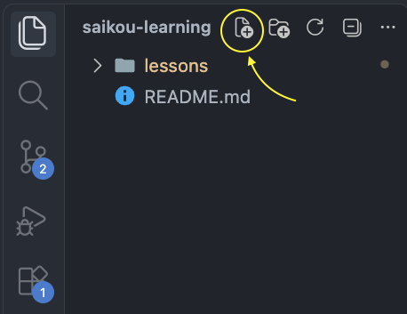
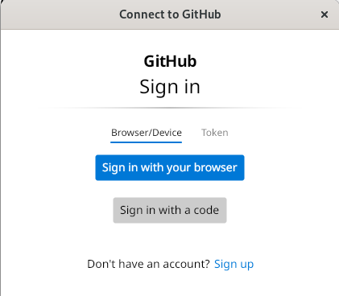
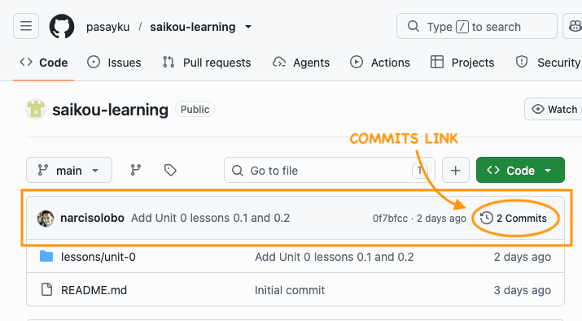

# Lesson 0.3: Your First Commit and Push

**Unit 0: Groundwork** · About 1 hour

## Why this comes next

Your practice repo lives on GitHub. Your tools are on your laptop. In this lesson you connect the two:

1. You copy your repo from GitHub to your laptop.
2. You make a change on your laptop.
3. You save that change with Git.
4. You send it back to GitHub.

After today, you'll do the same steps every time you study.

The first time you send work to GitHub, it asks you to sign in. That's the step most likely to go wrong. If it does, message me on WhatsApp with a screenshot, and we'll sort it out. If a WhatsApp voice call would help and it's affordable for you, we can do that instead. It's up to you.

## What you need

- Your laptop, with VS Code open
- An internet connection, to clone, push and pull. Writing and committing don't need it.
- Your phone, for your GitHub 2FA code

## A few words first

| Word | Meaning |
| --- | --- |
| **Clone** | Copy a repo from GitHub to your laptop. You only do this once per repo. |
| **Commit** | Take a picture of your work as it is right now. The **commit message** is the picture's caption, saying what changed. Commits stay on your laptop until you push. |
| **Push** | Send your commits to GitHub |
| **Pull** | Get new changes from GitHub, for example a new lesson from me |

## Step 1: Move around in the terminal

Open the terminal in VS Code (**Ctrl + `` ` ``**). Type each command and press **Enter**.

```
cd ~
```

`~` is short for your **home folder**. This makes sure you start there, whichever folder VS Code had open before.

```
pwd
```

`pwd` means *print working directory*. It shows which folder you're in. You'll see something like `/c/Users/saku`. That's your home folder.

```
ls
```

`ls` means *list*. It shows what's in the folder you're in.

```
mkdir projects
```

`mkdir` means *make directory*. *Directory* is another word for folder. This makes a folder called `projects`, where you'll keep all your coding projects.

```
cd projects
```

`cd` means *change directory*. You used it above to go home. Here it moves you into the `projects` folder. Run `pwd` again to check. It should end in `/projects`.

That's all the command line you need today. Lesson 0.4 covers more.

## Step 2: Two Git settings

You set your name and email in Lesson 0.2. Two more settings will save you trouble later. You only do this once.

```
git config --global pull.rebase true
```

Sometimes you'll save work on your laptop while I add a lesson on GitHub. This setting tells `git pull` to fit the two together neatly, instead of stopping with an error.

```
git config --global core.editor "code --wait"
```

Now if Git ever needs you to type a message, it opens a tab in VS Code instead of a text editor that's hard to use. Type the message, save, and close the tab.

## Step 3: Clone your practice repo

Still in the `projects` folder, type:

```
git clone https://github.com/pasayku/saikou-learning.git
```

Git copies your repo into a new folder called `saikou-learning`. Check that it's there:

```
ls
```

## Step 4: Open the repo in VS Code

```
cd saikou-learning
code .
```

`code` is VS Code's own command, like `git` is Git's. `code .` opens the folder you're in (`.` means "this folder") in VS Code. A new VS Code window opens. You can close the old one.

On the left, you'll see your files: `README.md` and the `lessons` folder. The lessons are on your laptop now, so you can read them without internet.

> [!NOTE]
> **What's a `.md` file?** Files ending in `.md` are **Markdown** files. Markdown is plain text with a few symbols for formatting: `#` makes a heading, `-` makes a bullet point, and `**bold**` makes text **bold**. GitHub and VS Code turn those symbols into formatted text. All your lessons are Markdown, and your journal will be too. You'll learn more in Unit 4.

**To read a lesson nicely:** open it, then press **Ctrl + Shift + V**. VS Code shows it formatted, like on GitHub. If the shortcut doesn't work, right-click the file in the list on the left and choose **Open Preview**.

> [!TIP]
> **If you're feeling comfortable:** install the **Markdown Preview Enhanced** extension for a nicer preview. Click the **Extensions** icon on the left (four squares), search for `Markdown Preview Enhanced`, and click **Install**. It needs internet to install, but works offline after that. You don't need it for this course.

Open a terminal in the new window (**Ctrl + `` ` ``**). It starts inside `saikou-learning`. From now on, run Git commands from here.

## Step 5: Ask Git what's going on

```
git status
```

`git status` tells you what Git sees. Right now it says something like:

```
On branch main
Your branch is up to date with 'origin/main'.

nothing to commit, working tree clean
```

That means nothing has changed since you cloned. Run `git status` whenever you're unsure what's happening. It never changes anything, so it's always safe.

## Step 6: Start your learning journal

Your **journal** is where you write a few lines after each study session: what you did, and what confused you. It helps you see how far you've come, and it shows me where to help.

1. In the file list on the left, hover over the folder name, **saikou-learning**, at the top. (VS Code may show it in capital letters.) Click the **New File** icon that appears (a page with a **+**).

   
2. Type `journal.md` and press **Enter**. The file appears next to `README.md` and opens.
3. Write your first entry. Use this layout:

```markdown
# Learning Journal

## 2026-10-10

- Lesson 0.1: made my GitHub account and practice repo.
- Lesson 0.2: installed VS Code, Git, Node.js, pnpm, Python and the GitHub CLI.
- Lesson 0.3: cloned my repo and made my first commit.
- Confusing: (write anything that confused you, or "nothing yet")
```

Use the real date. Put the newest entry at the bottom.

4. Save the file (**Ctrl + S**).

## Step 7: Commit your journal

Saving a commit takes two commands: `git add`, then `git commit`. This first time, you'll also run `git status` between them, to see what each command does. Later, you'll only run it when you want to check something.

Have a look first:

```
git status
```

You'll see something like this, with `journal.md` in red:

```
On branch main
Your branch is up to date with 'origin/main'.

Untracked files:
  (use "git add <file>..." to include in what will be committed)
        journal.md

nothing added to commit but untracked files present (use "git add" to track)
```

**Untracked** means Git sees a new file but isn't saving it yet.

Think of a commit as taking a picture of your work:

- `git add` puts a change on the **stage**, like arranging people for a group photo. Git calls this the **staging area**.
- `git commit` takes the picture of everything on the stage.

Anything you haven't added stays off the stage, so it isn't in the picture.

**Command 1:** tell Git which changes to include.

```
git add journal.md
```

Check what changed:

```
git status
```

Now `journal.md` is green:

```
On branch main
Your branch is up to date with 'origin/main'.

Changes to be committed:
  (use "git restore --staged <file>..." to unstage)
        new file:   journal.md
```

It's under **Changes to be committed**, so it's on the stage, ready for the picture.

**Command 2:** save the commit.

```
git commit -m "Add learning journal"
```

The text in quotes is your **commit message**, the caption on your picture. It says what this commit does, so that you (or I) can understand it months from now. Start it with a verb, like *Add*, *Fix* or *Update*.

Check once more:

```
git status
```

```
On branch main
Your branch is ahead of 'origin/main' by 1 commit.
  (use "git push" to publish your local commits)

nothing to commit, working tree clean
```

**Ahead by 1 commit** means your commit is saved on your laptop, but GitHub doesn't have it yet. `origin` is Git's name for your repo on GitHub.

## Step 8: Push to GitHub

```
git push
```

**The first time, a window called Connect to GitHub asks you to sign in.**



1. Click **Sign in with your browser**. If a window asks for a user name and password instead, don't type your GitHub password. Click **Cancel** and send me a screenshot.
2. Your browser opens. Sign in to GitHub if it asks, and enter the code from your authenticator app.
3. Click **Authorize** for **Git Credential Manager**.
4. Go back to VS Code. The push finishes.

Git saves your sign-in, so you won't have to do this again.

## Step 9: Check on GitHub

Open `https://github.com/pasayku/saikou-learning` in your browser.



- In the file list, you'll see `journal.md`.
- In the bar above the files, you'll see your name and your commit message, **Add learning journal**. (This picture was taken before your commit, so it shows mine.)
- Click the **commits** link at the right end of that bar (with a clock icon) to see every commit in the repo. Your work will build up there, one commit at a time.

## Step 10: Do it again

Now go round once more:

1. Add a line to today's journal entry, for example what you thought of your first push.
2. Save the file.
3. `git add journal.md`
4. `git commit -m "Update journal"`
5. `git push`
6. Check on GitHub that your new commit is there.

Run `git status` between any of these steps if you want to see what's happening.

## Step 11: Tell me you're done

Send me a WhatsApp message with:

- the link to your commit. On GitHub, open the commits list from Step 9 and click your **Update journal** commit. Copy the address from your browser.
- anything that didn't work, or that confused you

Then I'll add Lesson 0.4 to your repo.

## Step 12: Pull the next lesson

When I tell you Lesson 0.4 is ready, run this in the VS Code terminal:

```
git pull
```

Look in `lessons/unit-0/`. Lesson 0.4 is there now. If you have no internet when I message you, pull at the start of your next study session instead.

**From now on, start every study session with `git pull`.** That's how new lessons reach you.

## Your study session, from now on

| Step | Command | Needs internet? |
| --- | --- | --- |
| 1. Get new lessons | `git pull` | Yes |
| 2. Read and practise | | No |
| 3. Write in your journal | | No |
| 4. Commit | `git add`, then `git commit -m "..."` | No |
| 5. Send your work | `git push` | Yes |

If you have no internet at the end, skip step 5. Your commits wait on your laptop, and you push them next time you have internet access.

## If something goes wrong

- **A message about `LF` and `CRLF`:** that's about how Windows marks the end of each line. It's safe to ignore.
- **A new VS Code tab opens after `git commit`, and the terminal waits:** you left out `-m "..."`, so Git is asking for your commit message. Type it on the first line of the tab, save, and close the tab.
- **`git push` says `rejected` and `fetch first`:** GitHub has something you don't have yet, usually a new lesson from me. Run `git pull`, then `git push` again.
- **`fatal: not a git repository`:** you're in the wrong folder. Run `cd ~/projects/saikou-learning`.
- **The sign-in window doesn't appear, or the push fails another way:** send me a screenshot. We can sign in with `gh auth login` instead.

## Checklist

- [x] I can use `pwd`, `ls`, `mkdir` and `cd` to move around.
- [x] I set `pull.rebase` and `core.editor`.
- [x] My practice repo is cloned in `~/projects/saikou-learning`.
- [x] I can read a lesson in VS Code with **Ctrl + Shift + V**.
- [x] `journal.md` has my first entry, and it's on GitHub.
- [x] I made a second commit and pushed it.
- [x] I sent Narciso the link to my commit.
- [ ] I pulled Lesson 0.4.

## If you get stuck

Message me on WhatsApp. Tell me which step you're on and what you see on the screen. A screenshot helps a lot.

**Next:** Lesson 0.4, which you'll pull in Step 12. Open it in VS Code and read it with **Ctrl + Shift + V**.
